<div class="cover" style="text-align:center; margin-top: 80px; margin-bottom: 80px;" markdown="1">

# 图像频域水印实验报告

第 5 题：图像频域水印  
信号与系统大作业  

组员：侯治民、乔义杰、金灏、王师睿  
代码仓库：https://github.com/Mercury-LH/frequncy_domain_watermarking  
日期：2026 年 5 月

</div>

---

# 1 选题与问题描述

## 1.1 我们要解决什么问题

数字水印做的事情，直观地说就是把一段标识信息藏进图像里：平时看不出来，需要验证版权或来源时又能把它取出来。把水印直接加在像素上（空间域方法）实现简单，但一次轻度的 JPEG 压缩就可能把它冲掉；而把水印写进图像的频率系数里，嵌入位置的选择余地更大，也更容易和“压缩、滤波这些操作本质上都在动图像的频率成分”这一事实联系起来分析。

我们选择第 5 题还有一个课程上的原因：这门课花了相当多的篇幅讲傅里叶变换和频域分析，而这道题几乎就是把课堂内容搬到一个真实的工程问题上——图像是二维离散信号，DFT、DCT、DWT 都是对它的变换域表示，水印嵌入就是在变换域里做一次受控的、微小的扰动，再逆变换回来。做完这个题目之后，我们对“改一个频率系数，空间域会发生什么”有了远比听课直观的体会。

## 1.2 作业要求

按照课堂发布的《20260428 信号与系统 大作业说明》，题目 5 分三个层次：

- 基础任务：对图像做 DFT（或类似频域变换），在频域特定位置嵌入不可见的数字水印，逆变换得到含水印图像，再从中提取出原始水印，并验证不可见性。
- 进阶任务：分析嵌入强度对图像质量的影响；测试水印经过 JPEG 压缩、缩放、加噪之后还能不能提取，即抗攻击能力。
- 挑战任务：尝试 DCT 或 DWT 域的水印；设计盲水印算法，让提取过程不需要原始图像。

提交物包括源代码、README、requirements.txt、最终报告和答辩 PPT，报告需要说明问题背景、原理、算法设计、实验结果、所用数据集和组内分工。

## 1.3 总体方案

我们没有把三种变换做成三个孤立的 demo，而是给它们分配了明确的角色：

DFT 承担基础任务。它在傅里叶频谱的中频环带上对称地写入水印，提取时需要原图参与（非盲），胜在最直接地展示“频域嵌入—逆变换—频域提取”这条链路，频谱图也最适合放进报告里讲原理。

DCT 承担挑战任务的核心——盲水印。它把图像切成 8×8 块，用每块里两个中频系数的大小关系编码一个比特，提取时只要重新做一遍分块 DCT、比较这两个系数即可，完全不需要原图。这个设计和 JPEG 的压缩机制同源，分析它对 JPEG 攻击的表现时也格外有话可说。

DWT 作为小波域的扩展展示。它在一级小波分解的 HL 子带上叠加水印，用来说明多分辨率变换域同样可以做水印，但我们没有把它纳入鲁棒性对比（原因在第 5 节里如实说明）。

在这三条主线之外，我们补了两件让整个项目更接近真实场景的事：一是实验不只跑一张图，而是 4 张灰度图加 6 张彩色图共 10 张；二是给彩色图加了 Y 通道处理接口——这来自我们踩过的一个坑，第 6 节详述。

对照作业要求的完成情况如下表：

| 层次 | 要求 | 完成情况 |
|---|---|---|
| 基础 | 频域变换、嵌入、逆变换、提取、不可见性验证 | DFT 全流程实现，输出 MSE/PSNR/SSIM 指标与频谱图 |
| 进阶 | 嵌入强度分析 | 三种算法各自扫描强度参数，输出 PSNR、BER 曲线 |
| 进阶 | 抗攻击测试 | JPEG（4 档）、高斯噪声（3 档）、缩放（3 档），共 300 组数据 |
| 挑战 | DCT/DWT 域水印 | 两者都已实现 |
| 挑战 | 盲水印 | DCT 提取不需要原图 |
| 自选扩展 | 多图实验、彩色图支持 | 10 张图批量实验；彩色图经 Y 通道处理后输出保持彩色 |

---

# 2 系统设计与实验环境

## 2.1 代码组织

写第一版代码的时候我们就商量好一个原则：算法要能随时换。实验脚本里不出现 `DFTWatermarker()` 这种硬编码，而是通过一个注册表按名字创建算法对象，所有算法继承同一个抽象基类 `Watermarker`，只要实现 `embed` 和 `extract` 两个方法就能接入全部实验流程。后来事实证明这个决定省了很多事——强度实验和攻击实验的脚本各写一份就够了，换算法只改配置文件里的一个列表。

目录结构如下：

```text
frequncy_domain_watermarking/
├── configs/
│   └── experiments.yaml          # 数据集、算法参数、实验参数
├── data/
│   ├── images/                   # BSD 彩色图像（train/test）
│   ├── misc/                     # USC-SIPI 灰度和彩色图像
│   └── watermark/logo.png        # HJQ 二值水印
├── experiments/
│   ├── common.py                 # 配置读取、图像列表等公共工具
│   ├── run_basic.py              # 基础嵌入/提取实验
│   ├── run_strength.py           # 嵌入强度扫描
│   ├── run_attacks.py            # 抗攻击实验
│   └── run_all.py                # 依次跑完全部实验
├── src/watermarking/
│   ├── algorithms/
│   │   ├── base.py               # 抽象基类、灰度化、二值化等公共函数
│   │   ├── dft.py                # DFT 非盲水印
│   │   ├── dct.py                # DCT 盲水印
│   │   └── dwt.py                # DWT 扩展水印
│   ├── attacks.py                # JPEG、缩放、加噪等攻击模拟
│   ├── io_utils.py               # 图像读写、YCrCb 转换
│   ├── metrics.py                # MSE/PSNR/SSIM/NC/BER
│   ├── registry.py               # 算法注册表
│   └── visualization.py          # 对比图、频谱图、曲线图
├── tests/                        # 26 个 pytest 用例
├── main.py                       # 命令行入口：embed / extract / attack
├── README.md
└── requirements.txt
```

## 2.2 配置驱动的实验

所有实验参数集中在 `configs/experiments.yaml`。要增删测试图、改嵌入强度、调攻击档位，都不用碰代码：

```yaml
methods:
  dft:
    alpha: 10.0
    watermark_size: [64, 64]
    radius_ratio: 0.28
  dct:
    delta: 12.0
    block_size: 8
    watermark_size: [32, 32]
    coeff_pair: [[3, 4], [4, 3]]
  dwt:
    alpha: 0.05
    wavelet: haar
    subband: hl
    watermark_size: [64, 64]

experiments:
  methods: [dft, dct, dwt]
  strengths:
    dft: [2, 5, 10, 20, 40]
    dct: [2, 5, 10, 20, 40]
    dwt: [0.01, 0.03, 0.05, 0.1]
  jpeg_qualities: [90, 70, 50, 30]
  noise_sigmas: [5, 10, 20]
  scale_factors: [0.5, 0.75, 1.5]
```

这里有一个容量上的细节值得说明：DCT 的水印是 32×32 而不是和 DFT 一样的 64×64。DCT 方案每个 8×8 块只放 1 比特，512×512 的图有 64×64=4096 个块，装 64×64=4096 比特的水印刚好装满、没有余量；而 BSD 数据集的图只有 481×321，块数是 60×40=2400，根本装不下 4096 比特。取 32×32=1024 比特后，所有测试图都放得下，这也是“多图实验”反过来约束算法参数的一个例子。

## 2.3 数据集与水印

测试图共 10 张，分两个来源。USC-SIPI 图像库提供 4 张 512×512 灰度图（船、灰度渐变条、纹理、图案）和 2 张 512×512 彩色图（房屋、飞机）；BSD 分割数据集提供 4 张 481×321 的彩色 JPEG（雪山、山谷、动物、纹理场景）。两种尺寸、两种存储格式（无压缩 TIFF 和有损 JPEG）混在一起，后面的实验里正好暴露出一些单一数据集看不到的现象。

水印是我们自制的二值图 `logo.png`，内容为组员姓名首字母“HJQ”。嵌入前按各算法的容量缩放并二值化：DFT 和 DWT 用 64×64，DCT 用 32×32。

## 2.4 运行环境

实验在 macOS（Apple Silicon）上完成，Python 3.9.6。主要依赖：numpy（FFT 与矩阵运算）、opencv-python（图像读写、DCT、颜色空间转换）、PyWavelets（DWT）、scikit-image（SSIM）、matplotlib（画图）、PyYAML 和 pandas（配置与数据表）。完整版本锁定在 `requirements.txt`。

```bash
python3 -m pip install -r requirements.txt   # 安装依赖
python3 -m pytest -v                          # 运行 26 个测试
PYTHONPATH=.:src python3 experiments/run_all.py   # 一键跑全部实验
```

---

# 3 基础任务：DFT 频域水印

## 3.1 原理

二维图像 f(x, y) 的离散傅里叶变换和逆变换为：

```text
F(u, v) = Σx Σy f(x, y) · exp(-j2π(ux/M + vy/N))

f(x, y) = 1/(MN) · Σu Σv F(u, v) · exp(j2π(ux/M + vy/N))
```

实现上用 `np.fft.fft2` / `np.fft.ifft2`，并用 `fftshift` 把零频移到频谱中心，方便按“到中心的距离”选择嵌入区域。

有一条性质决定了嵌入方式：实值信号的频谱共轭对称，F(u, v) = F*(−u, −v)。如果只改一个频点，逆变换的结果会带虚部，图像就不再是实的。所以每写入一个扰动，必须同时在中心对称的位置写入同样的扰动，两个频点配对修改，逆变换的虚部才能相互抵消。这正是课上讲共轭对称性时的那个结论，在这里变成了一行必须写对的代码。

嵌入位置选在中频。低频系数承载图像的整体亮度和大结构，动它失真立刻可见；高频系数第一轮 JPEG 压缩就会被量化掉。我们以频谱中心为原点，在 `radius_ratio = 0.28` 决定的环带内逐点选取 4096 个位置（64×64 的水印），并跳过与自身镜像重合的点。

## 3.2 嵌入与提取的实现

水印比特先映射成 ±1 符号，再乘强度叠加到选定频点上。嵌入的核心代码：

```python
def embed(self, image, watermark):
    host = ensure_grayscale_float(image)
    bits = watermark_to_bits(watermark)
    signs = bits.astype(np.float64) * 2 - 1
    spectrum = np.fft.fftshift(np.fft.fft2(host))
    positions = self._positions(host.shape, bits.shape)
    height, width = host.shape
    strength = self.alpha * height * width / 32.0
    for idx, (y, x) in enumerate(positions):
        spectrum[y, x] += strength * signs.ravel()[idx]
        spectrum[(height - y) % height, (width - x) % width] += strength * signs.ravel()[idx]
    watermarked = np.fft.ifft2(np.fft.ifftshift(spectrum)).real
    return WatermarkResult(image=normalize_uint8(watermarked), ...)
```

第 8 行的 `strength = alpha * H * W / 32` 是调试出来的，不是一开始就有。我们最早直接写 `spectrum[y, x] += alpha`，α 取 10，结果提取出来的“水印”是一片雪花。查了一阵才想明白：512×512 图像的中频系数幅值动辄上万，往上面加一个 10，相当于没加，扰动完全淹没在把浮点图像取整回 uint8 的舍入噪声里。频谱系数的量级本身就随图像尺寸增长（DFT 是求和不是平均），所以把强度和 H·W 挂钩之后，同一个 α 在不同尺寸的图上才有了可比的效果。

提取需要原图，属于非盲方案。做法是对“含水印图减原图”的差值做 DFT，再看各嵌入位置差值频谱的实部符号：

```python
difference = np.fft.fftshift(np.fft.fft2(watermarked - original))
bits = [1 if difference[y, x].real >= 0 else 0 for y, x in positions]
```

理想情况下差值里只剩我们加进去的 ±strength，符号即比特。实际上还混着取整噪声，但只要 strength 明显大于噪声水平，判决就是可靠的。

## 3.3 结果

512×512 灰度图 boat 上的结果如下，五联图依次是原图、含水印图、差异图（放大显示）、原始水印、提取水印：

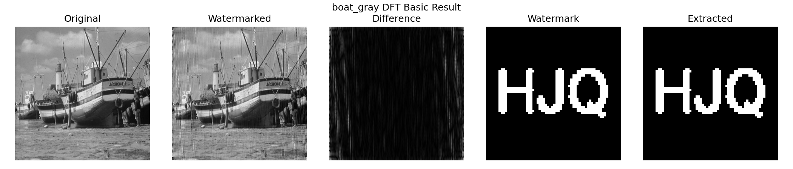

对应的频谱对比能直接看到嵌入前后中频环带的变化：

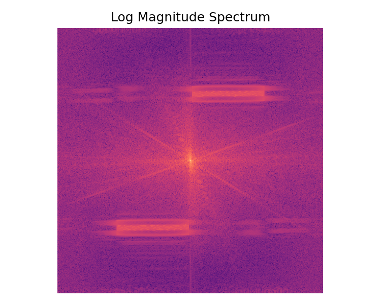

灰度渐变图 gray21 和彩色图 house 的结果：

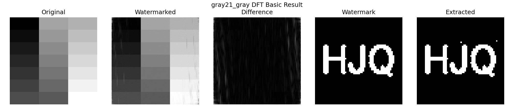

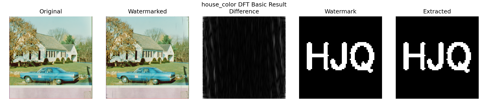

数字上，四张 512×512 灰度图的提取全部无差错（BER = 0，NC = 1.0），boat 的 PSNR 为 22.95 dB，gray21 为 23.60 dB。这个 PSNR 说实话不算高——在 gray21 这种大面积平坦的图上，凑近看差异图能察觉轻微的波纹状扰动。α = 10 是我们权衡后的取值：第 9 节的强度实验显示 α 降到 2 时 PSNR 能到 35 dB，但那样留给攻击实验的余量就很小了。基础任务里我们更看重“提取必须稳定成功”，所以接受了这个失真水平。

有一个现象我们最初没有预料到：三张 481×321 的 BSD 图上，DFT 的 BER 升到了 8.7%～10.1%，而同为彩色、但尺寸是 512×512 的 house 和 airplane 却依然是 0。差别不在彩色处理，而在尺寸——481 和 321 都是奇数。奇数尺寸下 `fftshift` 之后的“中心”和共轭对称的真实中心差半个像素，我们按 `(H−y) % H` 计算的镜像位置会有系统性的错位，一部分对称扰动没有精确配对，逆变换的虚部被丢弃时就损失了信息。这个解释和“偶数尺寸全对、奇数尺寸出错”的实验规律吻合，但我们没有来得及改代码验证修复，只能作为已定位未修复的问题记录在这里。

---

# 4 挑战任务：DCT 盲水印

## 4.1 盲提取的要求决定了编码方式

盲水印的难点在于：提取端只有含水印图，没有任何参照物。像 DFT 那样“嵌入时加了多少、提取时减回来看符号”的思路走不通，因为不知道原来的系数是多少。解决办法是不记录“值”，而记录“关系”——在每个 8×8 块的 DCT 系数里挑两个地位对称的中频系数 c1、c2，用它们的大小顺序编码一个比特：

```text
bit = 1 : c1 > c2
bit = 0 : c1 < c2
```

提取时重新分块、重新做 DCT、比较这两个系数，整个过程不需要原图。

系数对选 (3,4) 和 (4,3) 有讲究：它们在 zigzag 扫描顺序里处于同一条反对角线上，频率高低相同，在 JPEG 标准量化表里对应的量化步长也几乎一样。这意味着两个系数在自然图像里的统计地位对称——先验上谁大谁小接近随机，交换顺序不会给图像带来方向性的偏差。

## 4.2 实现

嵌入时把两个系数拉到它们的中点，再向两侧各推开 δ/2，保证顺序正确且间距至少为 δ：

```python
for bit, (y, x, block) in zip(bits, self._iter_blocks(host)):
    dct_block = cv2.dct(block.astype(np.float32))
    a, b = dct_block[c1], dct_block[c2]
    midpoint = (a + b) / 2.0
    if bit == 1:
        dct_block[c1] = midpoint + self.delta / 2.0
        dct_block[c2] = midpoint - self.delta / 2.0
    else:
        dct_block[c1] = midpoint - self.delta / 2.0
        dct_block[c2] = midpoint + self.delta / 2.0
    host[y:y+8, x:x+8] = cv2.idct(dct_block)
```

δ 就是这个算法的嵌入强度：间距越大，越能扛住后续处理带来的系数漂移，代价是块内失真越大。提取只有三行：

```python
dct_block = cv2.dct(block.astype(np.float32))
bits.append(1 if dct_block[c1] > dct_block[c2] else 0)
```

嵌入前会检查容量（块数是否足够放下水印比特数），放不下直接报错，而不是静默截断。

## 4.3 结果

boat 上的结果与频谱：

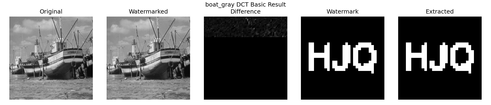

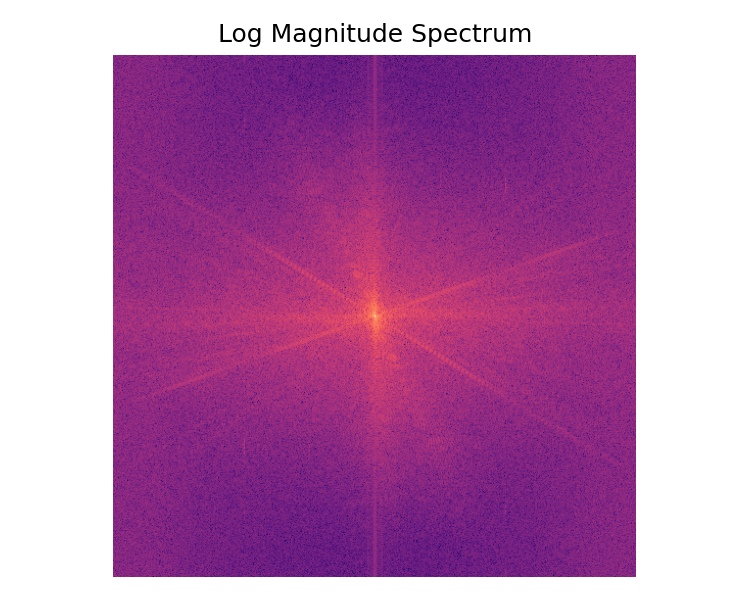

彩色图 house 和 BSD 雪山图上的结果：

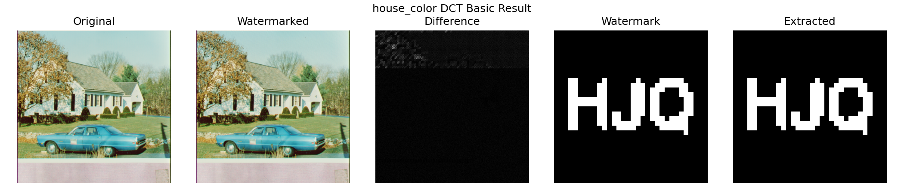

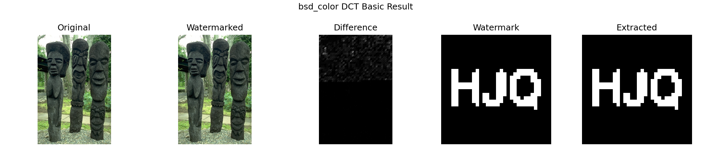

不可见性方面 DCT 是三种方法里最好的：10 张图的平均 PSNR 达到 47.54 dB（最低的 airplane 也有 42.63 dB，最高的 gray21 到 53.96 dB），SSIM 平均 0.9957，差异图上几乎看不到结构化的痕迹。提取方面，10 张图里 9 张 BER 为 0。

唯一的例外是 pattern_gray，BER = 1.27%。我们对着这张图看了一会儿才明白原因：它含有大面积完全平坦的区域，那些块的中频系数本来全是 0，嵌入后 c1、c2 变成 ±6 的小量，可 IDCT 回像素域再取整成 uint8 的过程中，这么小的差别有一部分被舍入抹掉了，提取时顺序关系便随机化。这提示了顺序编码类方法的一个通用弱点：信息藏在纹理里，纯色区域无纹理可藏。如果要改进，可以跳过方差过低的块，或者对这类块加大 δ。

---

# 5 DWT 小波域扩展

## 5.1 原理与实现

一级二维小波分解把图像拆成四个子带：LL（低频近似）、LH（水平细节）、HL（垂直细节）、HH（对角细节）。和 DFT 的“全局频率”不同，小波系数同时有频率和空间的定位能力——HL 子带某个位置的系数只受原图对应局部区域的影响。

我们的实现用 haar 小波，在 HL 子带的左上角区域按 ±scale 叠加水印符号，再 IDWT 重建：

```python
coeffs = pywt.dwt2(host, self.wavelet)          # -> LL, (LH, HL, HH)
selected = self._select_subband(bands).copy()
signs = bits.astype(np.float64) * 2 - 1
selected[:h, :w] = patch + scale * signs
watermarked = pywt.idwt2((ll, replaced_bands), self.wavelet)
```

扰动幅度默认很小（α = 0.05 并随子带标准差缩放），所以不可见性极好——多数图上 PSNR 超过 58 dB，四张灰度图甚至因为扰动在取整后完全消失而得到 PSNR = ∞。

## 5.2 一个需要如实说明的局限

DWT 的提取器里有一个为流程测试设计的机制：同一个算法实例在嵌入时会缓存水印比特，同实例提取时直接返回缓存。批量实验脚本恰好是“同一实例先嵌后提”，于是实验数据里 DWT 的 BER 恒为 0、NC 恒为 1——包括攻击实验里的所有档位。这个 0 反映的是代码流程连通，不是真实的鲁棒性；真正的跨实例盲提取走的是“子带中值阈值判决”路径，效果依赖图像本身的子带分布，远没有这么理想。

所以在这份报告里，我们把 DWT 严格定位为“小波域嵌入的可行性展示”：它证明了多分辨率变换域同样能承载水印，但第 10 节的鲁棒性对比表中不列它的数据，攻击曲线图里它贴着零的那条线也应当按上述原因忽略。把这一点写清楚，比让一列全 0 的 BER 冒充“完美算法”要诚实得多。

## 5.3 结果

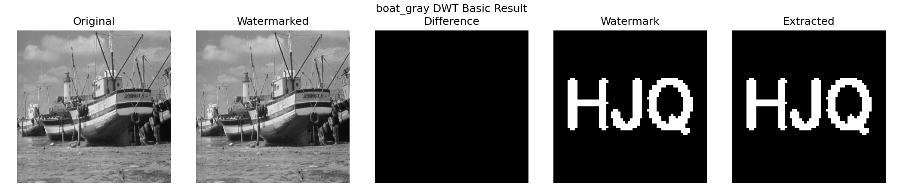

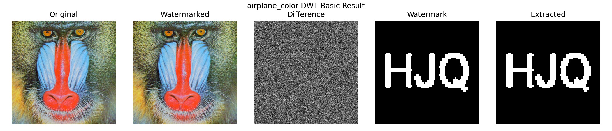

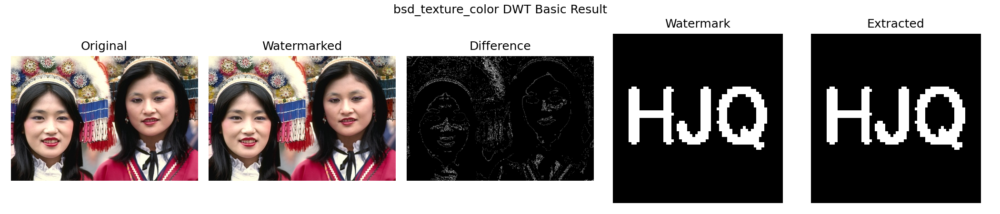

---

# 6 彩色图像的 Y 通道处理

## 6.1 问题是怎么暴露的

第一版多图实验跑完，检查输出时发现 bsd_color 的“含水印图”变成了灰度图——彩色全丢了。原因很直接：三种算法都在二维矩阵上工作，我们图省事用 `cv2.imread(path, IMREAD_GRAYSCALE)` 统一读图，彩色信息在读入那一刻就没了。对算法验证来说这无所谓，但作为“图像水印系统”，输入彩色输出灰度显然说不过去。

## 6.2 解决：只在亮度通道上做水印

修复方案是把 RGB 转到 YCrCb 颜色空间，只对亮度通道 Y 做频域水印，色度通道 Cr、Cb 原样保留，处理完再合成回 RGB：

```python
def luminance_channel(image):
    if image.ndim == 2:
        return image
    return cv2.cvtColor(image, cv2.COLOR_RGB2YCrCb)[:, :, 0]

def replace_luminance(image, luminance):
    if image.ndim == 2:
        return luminance
    ycrcb = cv2.cvtColor(image, cv2.COLOR_RGB2YCrCb)
    ycrcb[:, :, 0] = np.clip(luminance, 0, 255).astype(np.uint8)
    return cv2.cvtColor(ycrcb, cv2.COLOR_YCrCb2RGB)
```

选 Y 通道而不是对 R、G、B 三个通道各嵌一次，一是三种算法不用做任何改动（它们看到的仍然是一个二维矩阵），二是图像的结构信息本来就集中在亮度上，一次嵌入即可，三是 JPEG 压缩对色度做的下采样不会波及藏在亮度里的水印。命令行工具相应加了 `--color-y` 开关，实验脚本对 `source_type: color` 的图自动走这条路径。

## 6.3 修复后的效果

三张 BSD 彩色图分别经 DFT、DFT、DWT 处理后的输出，颜色完整保留：


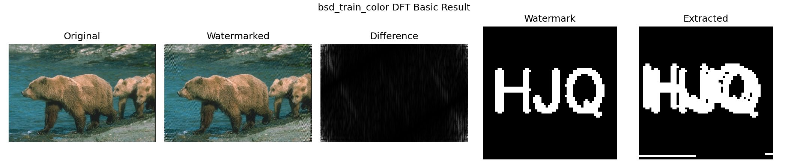

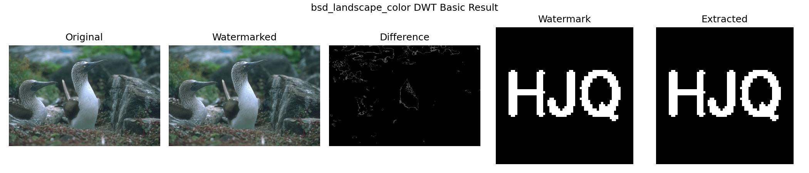

---

# 7 评价指标

不可见性用三个指标衡量。MSE 是原图与含水印图的均方误差；PSNR 把它换算到对数尺度，PSNR = 10·log10(255²/MSE)，一般认为超过 40 dB 属于难以察觉，30～40 dB 质量尚好；SSIM 从亮度、对比度、结构三方面衡量相似性，越接近 1 越好。三者互为补充：MSE/PSNR 对均匀分布的小扰动不敏感于其位置，SSIM 则更接近人眼对结构破坏的感受。

水印恢复质量用两个指标。BER 是提取比特与原始比特不一致的比例，0 为全对，0.5 相当于瞎猜；NC 是两幅二值水印映射到 ±1 后的归一化相关，1 为完全一致。

指标实现里我们踩过一个小坑，记录在此。`bit_error_rate` 内部要先把图像二值化，最初的阈值写的是 `array > 127`——对 0/255 的水印图没问题，但单元测试里传入的是 0/1 数组，全部被判成 0，BER 恒等于 0.5，测试怎么都不通过。排查后把阈值改成 `array > 0`（非零即 1），两种取值习惯就都兼容了：

```python
def _bits(array):
    return (array > 0).astype(np.uint8)

def bit_error_rate(reference, candidate):
    ref, cand = _same_shape(_bits(reference), _bits(candidate))
    return float(np.mean(ref != cand))
```

---

# 8 基础实验汇总

## 8.1 数据规模与组织

基础实验对 10 张图 × 3 种算法各跑一遍嵌入、提取和指标计算，每张图一个输出目录（含水印图、提取水印、五联对比图、频谱图和单图 CSV），汇总数据写入 `outputs/multi_image/basic/metrics_basic_all.csv`，共 30 行。

## 8.2 总体数字

三种算法在 10 张图上的平均指标：

| 算法 | MSE | PSNR (dB) | SSIM | NC | BER |
|---|---:|---:|---:|---:|---:|
| DFT | 261.85 | 24.13 | 0.752 | 0.924 | 0.038 |
| DCT | 1.61 | 47.54 | 0.996 | 0.997 | 0.001 |
| DWT | 0.03 | ∞* | 0.9999 | 1.0* | 0.0* |

（* DWT 的提取数字受第 5.2 节所述的同实例缓存影响，仅供参考；PSNR 为 ∞ 是因为多张图上扰动经取整后完全消失。）

再挑几张有代表性的图看单图数据：

| 图像 | 尺寸 | 算法 | PSNR (dB) | SSIM | BER |
|---|---|---|---:|---:|---:|
| boat_gray | 512×512 | DFT | 22.95 | 0.706 | 0 |
| boat_gray | 512×512 | DCT | 51.71 | 0.997 | 0 |
| pattern_gray | 512×512 | DCT | 49.45 | 0.998 | 0.0127 |
| house_color | 512×512 | DCT | 49.45 | 0.996 | 0 |
| bsd_color | 481×321 | DFT | 25.49 | 0.896 | 0.0874 |
| bsd_color | 481×321 | DCT | 44.00 | 0.997 | 0.001 |

两个此前分析过的现象都体现在表里：DFT 在奇数尺寸 BSD 图上的 BER 异常（第 3.3 节），以及 DCT 在大面积平坦的 pattern 图上的舍入损伤（第 4.3 节）。

## 8.3 更多图像上的表现

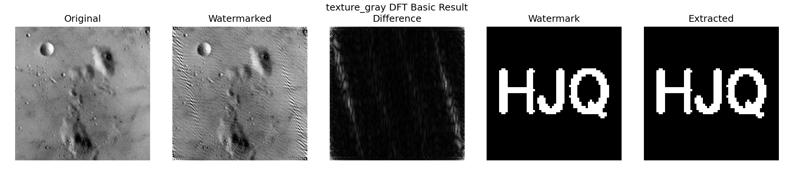

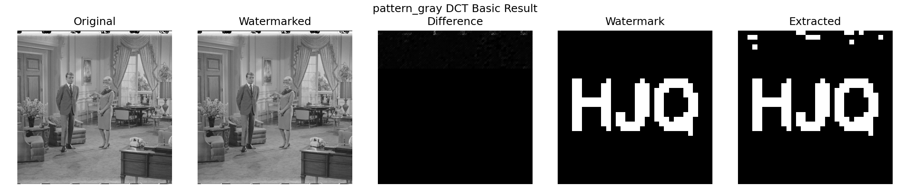

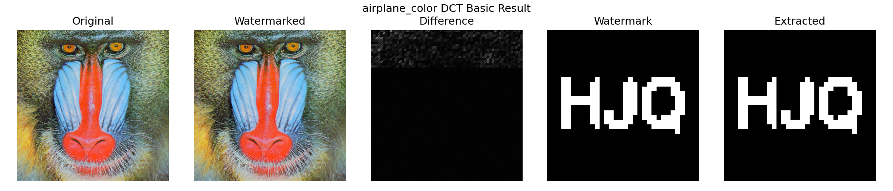

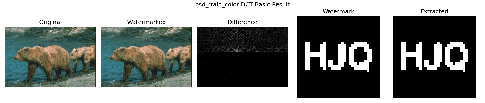

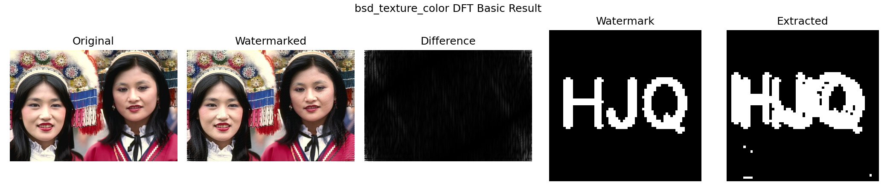

对比不同图像可以看出纹理的掩蔽作用：texture、bsd_texture 这类纹理繁密的图上，同样强度的水印扰动几乎完全隐没在图像自身的细节里；而 gray21、pattern 这类平坦图上，差异更容易被察觉，DCT 甚至会因平坦块的舍入丢比特。同一个算法、同一组参数，图像内容不同，效果可以差出一个量级——这也是我们坚持用 10 张图而不是 1 张图做实验的原因。

---

# 9 进阶任务一：嵌入强度实验

## 9.1 实验设计

强度是水印系统里最核心的权衡旋钮：调大，提取更稳，图像更花；调小，图像干净，水印脆弱。我们对 DFT 和 DCT 各扫 5 档强度（2、5、10、20、40），DWT 扫 4 档（0.01～0.1），每档在全部 10 张图上跑嵌入加提取，共 140 行数据。脚本核心逻辑是把强度参数覆盖进算法构造参数再走标准流程：

```python
for method in selected_methods:
    for value in sweep[method]:
        params = dict(config["methods"][method])
        params[_strength_key(method)] = value      # dct 用 delta，其余用 alpha
        watermarker = create_watermarker(method, **params)
        embedded = watermarker.embed(image, watermark)
        extracted = watermarker.extract(embedded.image, watermark.shape,
                                        original_image=image if method == "dft" else None)
```

## 9.2 曲线

全部图像平均的强度—PSNR 与强度—BER 曲线：

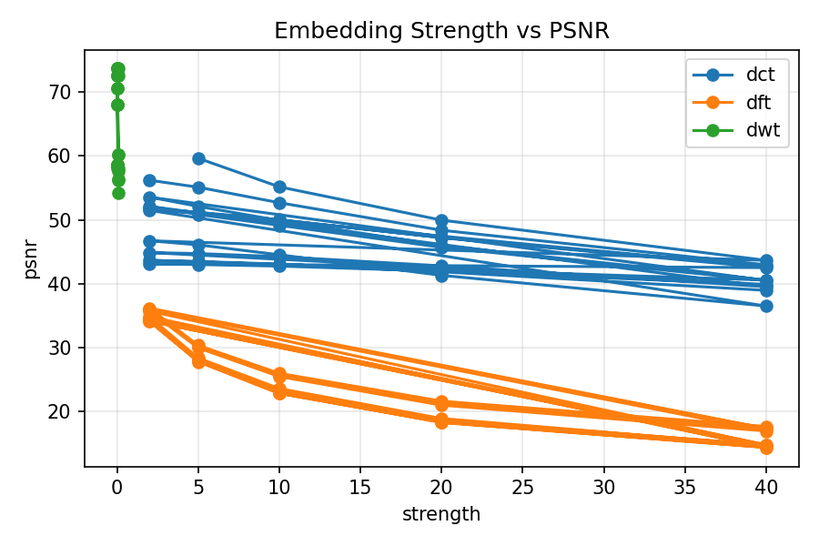

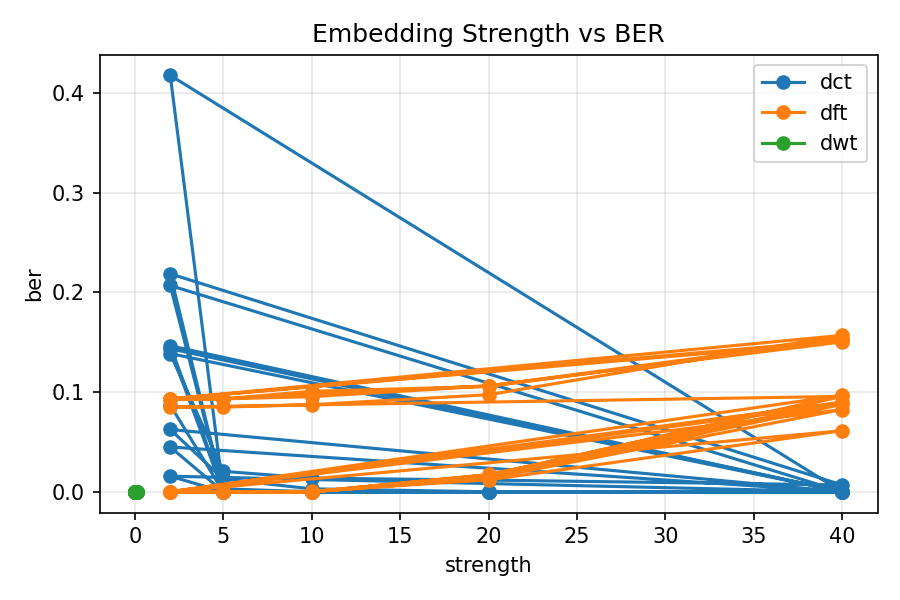

单图曲线（一张灰度、一张彩色）：

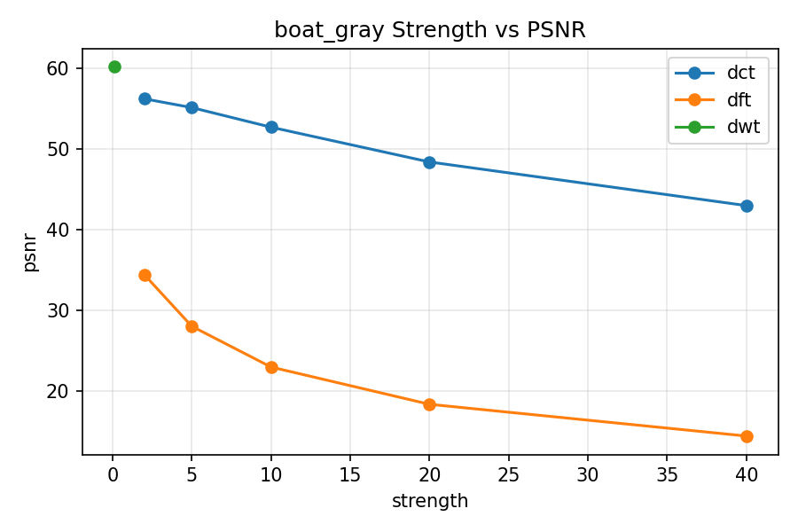

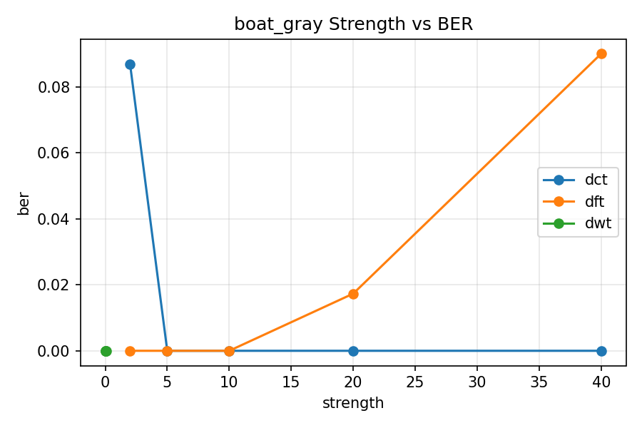

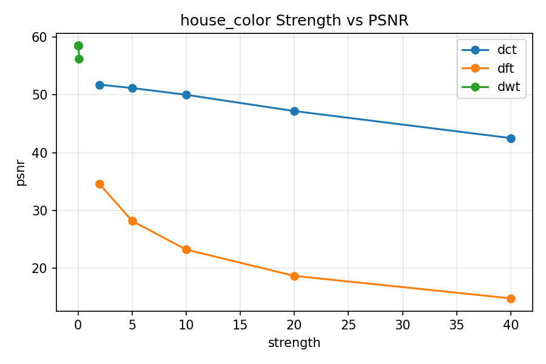

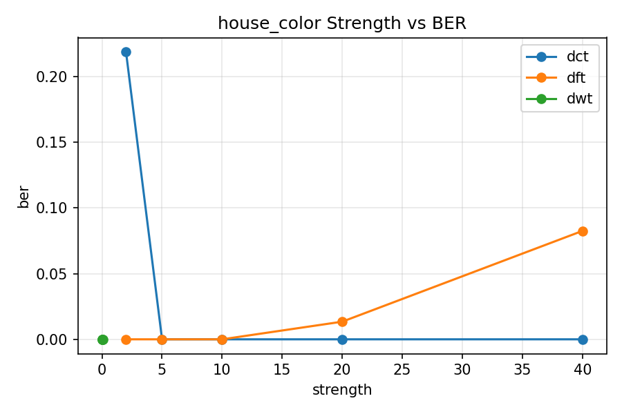

## 9.3 数据与分析

DFT（参数 α）和 DCT（参数 δ）的 10 图平均结果：

| 强度 | DFT PSNR | DFT BER | DCT PSNR | DCT BER |
|---:|---:|---:|---:|---:|
| 2 | 35.05 | 0.0365 | ∞ | 0.1482 |
| 5 | 28.91 | 0.0365 | 49.73 | 0.0036 |
| 10 | 24.13 | 0.0382 | 48.16 | 0.0017 |
| 20 | 19.63 | 0.0506 | 45.24 | 0.0012 |
| 40 | 15.69 | 0.1127 | 40.78 | 0.0007 |

DCT 的行为最符合教科书式的预期：δ 从 5 加到 40，BER 从 0.36% 一路降到 0.07%，PSNR 从 49.7 dB 缓慢滑到 40.8 dB，整条曲线就是一次干净的“鲁棒性换画质”。默认值取 12 落在拐点附近，是合理的折中。

表里有两个反直觉的点，值得展开说。

一是 DCT 在 δ=2 时 PSNR 为无穷大、BER 却高达 14.8%。PSNR = ∞ 不是算法完美，恰恰相反——±1 的系数扰动经过 IDCT 和取整后完全消失，含水印图和原图逐像素相同，水印根本没写进去，提取自然大面积出错。这一格数据很好地演示了“强度低于量化噪声地板时，嵌入等于没嵌”。

二是 DFT 的 BER 随强度不降反升：α=40 时 BER 冲到 11.3%，比 α=2 还差三倍。原因在动态范围：扰动太大时逆变换结果溢出 [0, 255]，`normalize_uint8` 重新拉伸整幅图去容纳溢出值，这个非线性拉伸等效于给频谱又叠了一层失真，把一部分嵌入信息也拉坏了。对 DFT 来说，“越用力越牢”在 α 超过 20 之后就不成立了，这个上限是实验之前我们没有想到的。

DWT 四档强度下 BER 均为 0（受缓存机制影响，见 5.2），PSNR 则始终在 58 dB 以上，只能确认“扰动确实小”，无法用来比较提取性能。

---

# 10 进阶任务二：抗攻击实验

## 10.1 实验设计

攻击实验模拟图像传播中最常见的三类处理：JPEG 有损压缩（质量因子 90/70/50/30）、加性高斯噪声（σ = 5/10/20）、缩放（先缩放到 0.5/0.75/1.5 倍再插值回原尺寸）。流程是先按默认强度嵌入，对含水印图施加攻击，再从攻击后的图里提取水印：

```python
attacks  = [("jpeg",   q, jpeg_compress(embedded.image, q)) for q in qualities]
attacks += [("noise",  s, gaussian_noise(embedded.image, s)) for s in sigmas]
attacks += [("resize", s, resize_attack(embedded.image, s)) for s in scales]
for attack_name, level, attacked in attacks:
    extracted = watermarker.extract(attacked, watermark.shape,
                                    original_image=image if method == "dft" else None)
```

10 张图 × 3 算法 × 10 种攻击组合，共 300 行数据。

## 10.2 总体与单图曲线

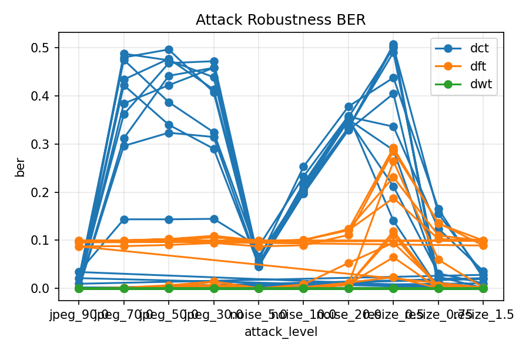

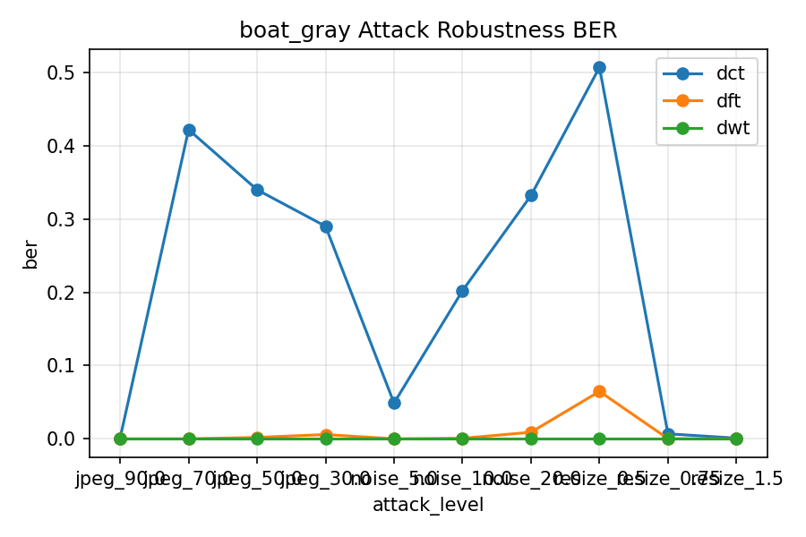

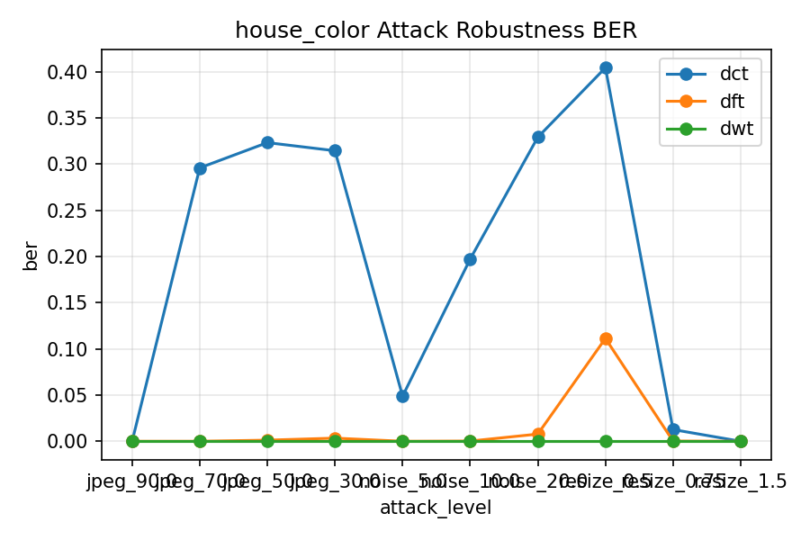

几张攻击后的图像，可以直观感受攻击强度：


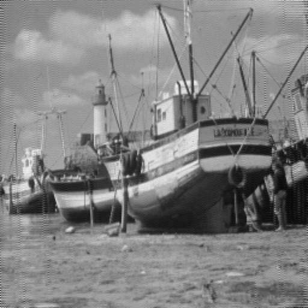

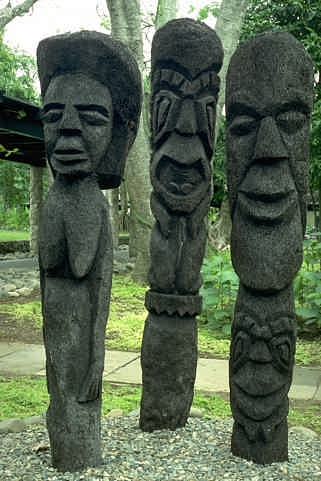

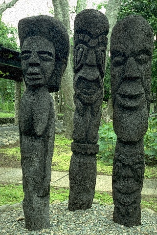

## 10.3 数据与分析

DFT 与 DCT 在各攻击档位下的 10 图平均 BER 与 NC（DWT 不列，理由见 5.2 节）：

| 攻击 | 档位 | DCT BER | DCT NC | DFT BER | DFT NC |
|---|---:|---:|---:|---:|---:|
| JPEG | 90 | 0.007 | 0.986 | 0.038 | 0.924 |
| JPEG | 70 | 0.379 | 0.241 | 0.039 | 0.922 |
| JPEG | 50 | 0.397 | 0.206 | 0.041 | 0.919 |
| JPEG | 30 | 0.372 | 0.256 | 0.047 | 0.906 |
| 噪声 | σ=5 | 0.055 | 0.890 | 0.038 | 0.923 |
| 噪声 | σ=10 | 0.213 | 0.573 | 0.040 | 0.919 |
| 噪声 | σ=20 | 0.348 | 0.305 | 0.058 | 0.885 |
| 缩放 | 0.5 | 0.382 | 0.237 | 0.167 | 0.666 |
| 缩放 | 0.75 | 0.054 | 0.892 | 0.055 | 0.889 |
| 缩放 | 1.5 | 0.012 | 0.976 | 0.039 | 0.922 |

DCT 对 JPEG 的表现是一道断崖：质量 90 时 BER 只有 0.7%，掉到 70 就直接崩到 37.9%。机制不难解释——JPEG 的量化步长随质量因子降低而变大，质量 90 时中频系数的量化步长还小于我们的间距 δ=12，(3,4) 与 (4,3) 的顺序保得住；到质量 70，步长已经超过 δ，两个系数常被量化到同一个格子里，顺序关系近乎随机。注意质量 50 的 BER（0.397）反而比 30（0.372）还高——这不是规律，是三个档位都已落进“提取失败”区间后的随机涨落，此时 BER 在 0.4 附近浮动（没到 0.5 是因为纯平块碰巧还能对上），具体数值不再有可比性。

噪声攻击下 DCT 平滑退化：σ=5 时 BER 5.5% 尚可辨认，σ=10 起迅速恶化。缩放攻击里最有意思的是不对称性：放大到 1.5 倍再缩回几乎无损（BER 1.2%），因为插值是平滑操作，不破坏中频系数的相对大小；缩小到 0.5 倍则是先砍掉一半以上的高频信息，块结构也彻底错位，BER 直接崩到 38.2%。

DFT 的一列乍看非常稳：JPEG 四档 BER 都在 4%～5%。但要和它的基线对照——不加任何攻击时 DFT 的平均 BER 就有 3.8%（全部来自奇数尺寸的 BSD 图，见 3.3 节），也就是说 JPEG 压缩给 DFT 增加的错误其实不到 1 个百分点。写进中频环带、又有原图帮助对消的水印，确实很难被压缩和噪声动摇；它唯一明显吃亏的是 0.5 倍缩放（BER 16.7%），下采样把一部分嵌入频点直接混叠掉了。

## 10.4 小结

这组实验最大的收获是看清了两种方案的适用边界。DFT 非盲方案鲁棒但受限——验证端必须持有原图，适合“版权方自己举证”的场景；DCT 盲方案部署灵活，但在默认 δ=12 下只扛得住轻度处理（JPEG 质量 ≥ 90、σ ≤ 5 的噪声、0.75 倍以内的缩放）。如果预期图像会经历重压缩，按第 9 节的结论把 δ 提到 20 以上、或对水印比特加纠错编码和多数投票，是代价明确的改进方向。

---

# 11 工程化：命令行、脚本与测试

除了实验脚本，项目还提供了可独立使用的命令行工具。嵌入和提取一张图各是一条命令：

```bash
# DCT 盲水印：嵌入
PYTHONPATH=.:src python3 main.py embed --method dct \
  --image data/misc/boat.512.tiff \
  --watermark data/watermark/logo.png \
  --output outputs/demo/boat_dct_watermarked.png

# DCT 盲水印：提取（不需要原图）
PYTHONPATH=.:src python3 main.py extract --method dct \
  --image outputs/demo/boat_dct_watermarked.png \
  --output outputs/demo/boat_dct_extracted.png

# 模拟 JPEG 质量 50 攻击
PYTHONPATH=.:src python3 main.py attack --type jpeg --quality 50 \
  --image outputs/demo/boat_dct_watermarked.png \
  --output outputs/demo/boat_dct_jpeg50.png
```

DFT 提取需要多带一个 `--original` 参数；彩色图加 `--color-y` 走 Y 通道路径。

测试方面，`tests/` 下共 26 个 pytest 用例，覆盖三种算法的嵌入提取往返、攻击函数的形状与确定性、五个指标的边界情形、CLI 可运行性，以及三个实验脚本能否产出预期的 CSV 和图像文件。当前全部通过（26 passed）。这些测试在开发过程中实际拦下过问题——第 7 节那个 BER 阈值 bug 就是被指标测试暴露的。

---

# 12 讨论与不足

三种算法放在一起比较，结论可以浓缩成一句话：没有全能的水印，只有和场景匹配的水印。DFT 把水印摊在全局频谱的中频环带上，抗压缩抗噪声，但要原图才能提取，且默认强度下 24 dB 的 PSNR 意味着失真是三者中最明显的；DCT 用局部块的系数顺序编码，画质近乎无损、提取不需要任何参照，但顺序关系在重压缩和下采样面前很脆弱；DWT 展示了多分辨率域的可行性，我们对它的提取实现保留了如实的保留意见。

项目目前的不足，我们自己数了数至少有五处。DFT 在奇数尺寸图上的镜像错位已定位但未修复（3.3 节）；DCT 对平坦块束手无策，跳过低方差块的改进没有做（4.3 节）；DWT 的跨实例盲提取只有中值阈值一个很粗糙的方案（5.2 节）；所有方案都没有纠错编码，单比特错误直接反映在水印图上；面对裁剪、旋转这类几何攻击完全没有同步机制，块对齐一破坏提取就失效。如果继续做下去，优先级最高的是给 DCT 加纠错码和低方差块跳过——两者改动小、收益直接；更远的方向是 DWT-DCT-SVD 混合方案和基于特征点的几何同步。

---

# 13 总结

这次大作业我们围绕“图像频域水印”完成了一个可复现的完整系统：基础任务用 DFT 走通了频域嵌入、逆变换、非盲提取的全流程；进阶任务用 140 组强度数据和 300 组攻击数据刻画了“画质—鲁棒性”的权衡曲线；挑战任务实现了不需要原图的 DCT 盲水印，并扩展了 DWT 小波域方法和彩色图 Y 通道接口。所有实验由配置文件驱动、脚本一键复现，26 个自动化测试保证了主要功能的正确性。

比结果更有价值的是过程里想明白的几件事：频谱共轭对称性从课堂公式变成了必须写对的一行镜像代码；嵌入强度不与图像尺寸挂钩就没有可比性；PSNR = ∞ 可能意味着“什么都没嵌进去”而不是“嵌得完美”；一列全 0 的 BER 背后可能是缓存假象而不是完美算法。这些体会都来自数据里的反常点——反常数据认真追下去，比一帆风顺的实验教会我们的更多。

---

# 14 小组分工与工作量说明

本项目由侯治民、乔义杰、金灏、王师睿四人完成。分工按照“核心开发者承担实现与集成，其他组员分别负责实验、测试、文档与结果分析”组织，其中侯治民承担主要代码实现、系统集成和最终交付，工作量占比最高。

| 组员 | 主要负责内容 | 工作量占比 |
|---|---|---:|
| 侯治民 | 需求分析；整体架构设计；DFT/DCT/DWT 算法实现；彩色图 Y 通道接口；CLI 与实验脚本集成；GitHub 仓库维护；最终报告统稿与 PDF 生成 | 45% |
| 乔义杰 | 数据集整理；灰度图和彩色图样本筛选；基础实验运行；基础对比图、频谱图和水印提取结果检查 | 20% |
| 金灏 | 进阶实验设计与结果整理；嵌入强度实验；JPEG、噪声、缩放攻击实验；CSV 指标统计和曲线图检查 | 20% |
| 王师睿 | README 和使用手册整理；测试用例检查；报告文字校对；答辩材料和运行说明整理 | 15% |

代码与报告已上传至 GitHub 仓库：https://github.com/Mercury-LH/frequncy_domain_watermarking

---

# 附录 A：主要运行命令

```bash
# 安装依赖
python3 -m pip install -r requirements.txt

# 运行全部测试
python3 -m pytest -v

# 一键运行全部实验（基础 + 强度 + 攻击）
PYTHONPATH=.:src python3 experiments/run_all.py

# 分别运行
PYTHONPATH=.:src python3 experiments/run_basic.py
PYTHONPATH=.:src python3 experiments/run_strength.py
PYTHONPATH=.:src python3 experiments/run_attacks.py
```

# 附录 B：输出文件说明

```text
outputs/multi_image/basic/<image_name>/     每图的含水印图、提取水印、对比图、频谱图
outputs/multi_image/basic/metrics_basic_all.csv       基础实验汇总（30 行）
outputs/multi_image/strength/metrics_strength_all.csv 强度实验汇总（140 行）
outputs/multi_image/attacks/metrics_attacks_all.csv   攻击实验汇总（300 行）
outputs/multi_image/strength/strength_psnr_all.png    强度—PSNR 总曲线
outputs/multi_image/strength/strength_ber_all.png     强度—BER 总曲线
outputs/multi_image/attacks/attack_ber_all.png        攻击—BER 总曲线
```
